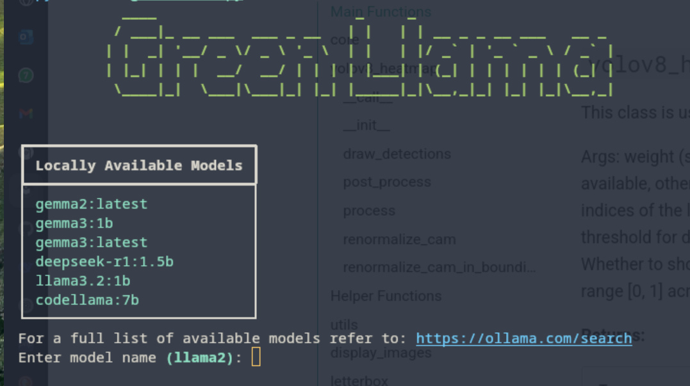

# Green_llama

# Green Llama: Ollama Performance Monitor

Green Llama is a command-line tool designed to monitor and analyze the performance of Ollama models. It provides real-time CPU usage and estimated FLOPs/sec metrics, allowing you to assess the efficiency of different models and prompts.



## Features

- **Model Management:**
  - Lists locally available Ollama models.
  - Downloads models directly from the Ollama repository.
- **Performance Monitoring:**
  - Measures and displays CPU usage during model inference.
  - Estimates FLOPs/sec to gauge computational performance.
  - Real-time metric collection.
- **Data Logging:**
  - Saves metrics to a CSV file (`metrics.csv`) for further analysis.
- **Visualization:**
  - Plots a bar graph of metrics per prompt to visualize performance over time.
- **Interactive Interface:**
  - Provides a user-friendly command-line interface with prompts and tables.
  - Allows for easy model selection and metric choice.
- **Summary Statistics:**
  - Calculates and displays average metrics for the session.

## Prerequisites

- Python 3.6+
- Ollama installed and running.

## Installation

1. Clone the repository:
    ```sh
    git clone https://github.com/ThePhilippeH/green_llama.git
    ```

2. Install Python dependencies:
    ```sh
    pip install .
    ```

3. Install Node.js dependencies for the report viewer:
    ```sh
    cd report_viewer
    npm install
    cd ..
    ```
## Usage

### Running the Main Application

To start the main application, first the user should start running Ollama locally and start green-llama by:
```sh
green-llama
```

### Commands and Options

1. **Model Selection:**
   - The tool will display a list of locally available models.
   - Enter the name of the model you want to use.
   - If the model is not available, you will be prompted to download it.
   - Type `web report` to open the report viewer in your web browser.'
   - Type `rankings` to view the rankings of the models based on their performance.


2. **Prompt Input:**
   - Enter your prompts to interact with the model.
   - Type `restart` to change the model.
   - Type `exit` to quit the application.
   - Type `summary` to view collected metrics and graphs.
   - Type `benchmark` to run benchmark tests on the model.
